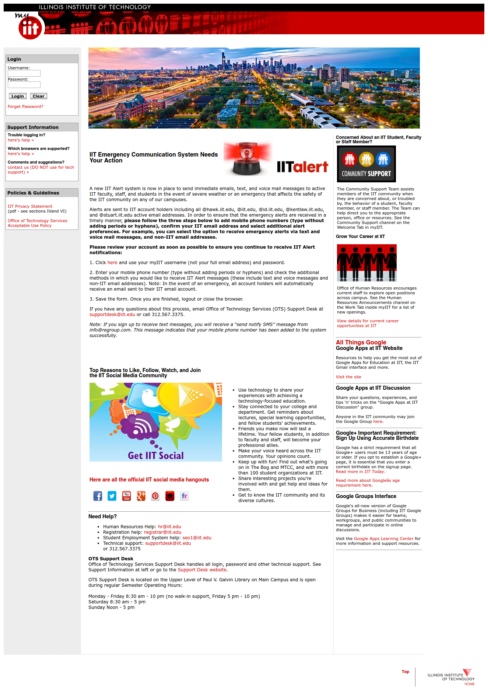
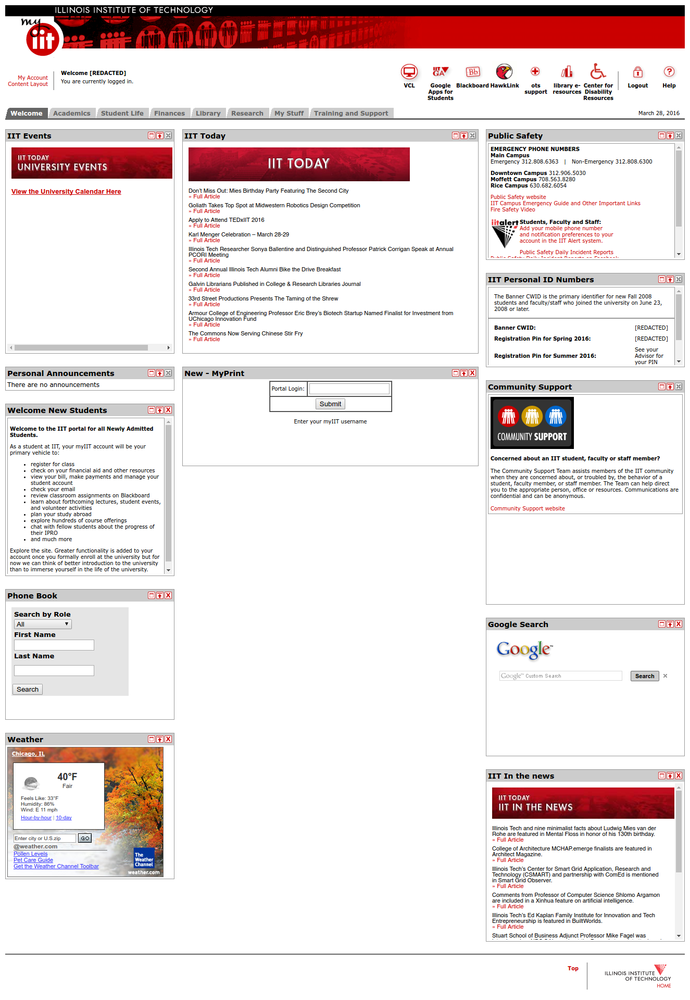
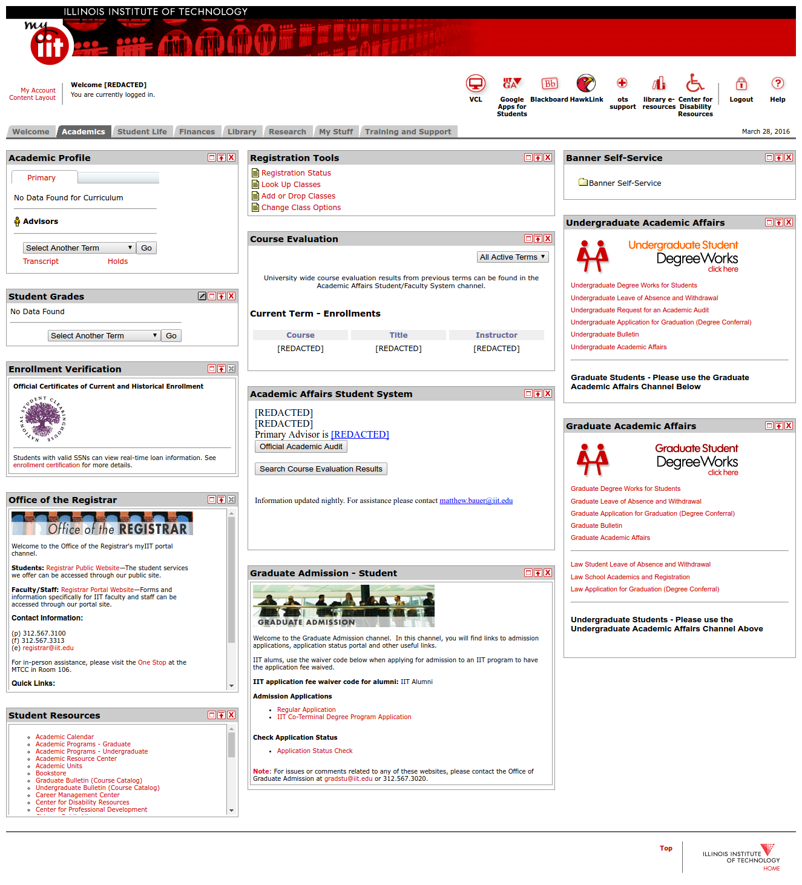
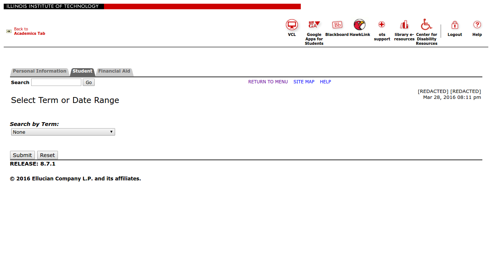
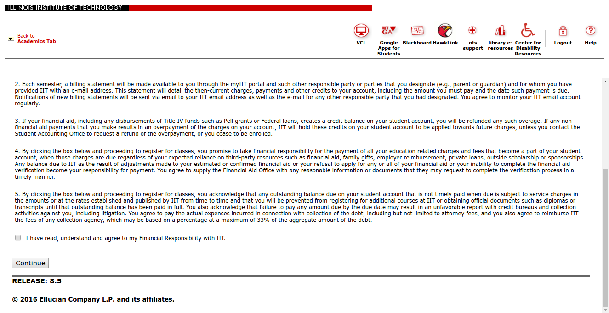
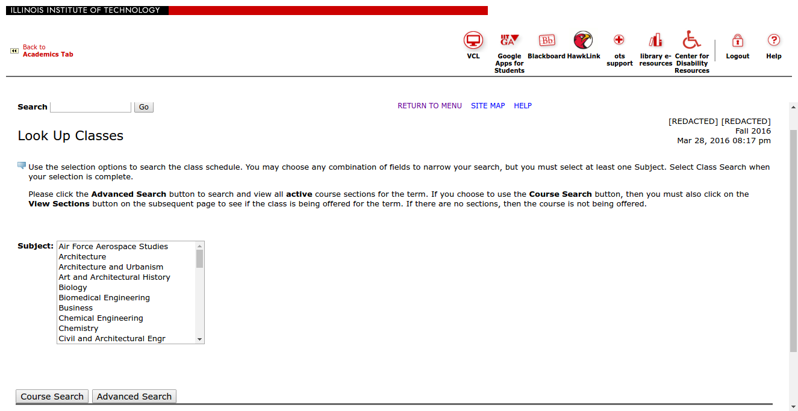
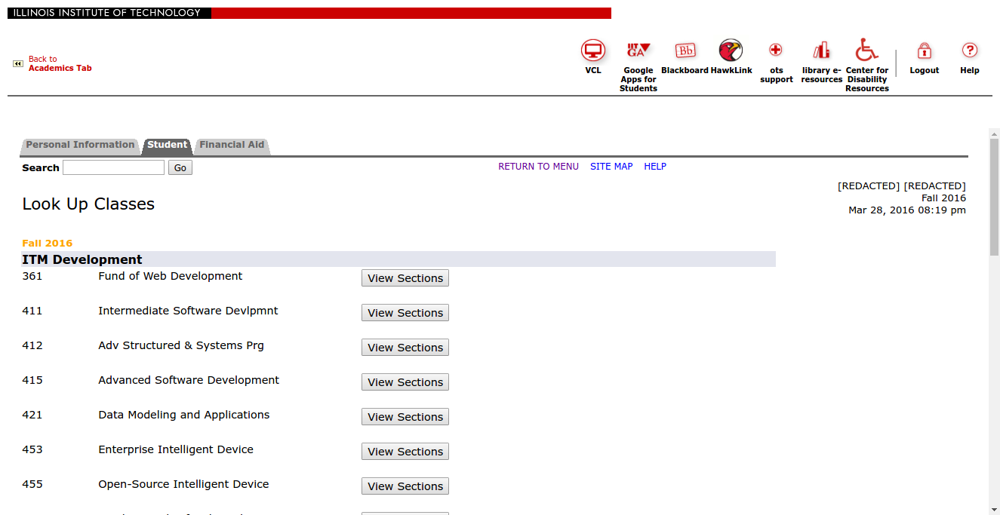
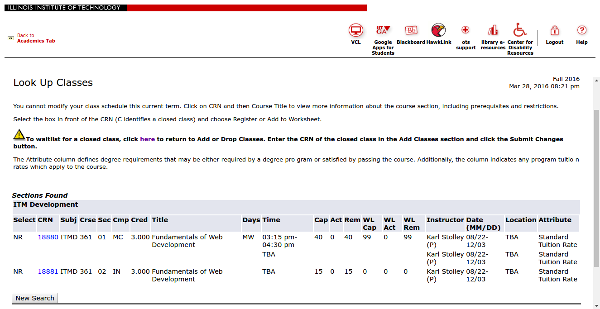
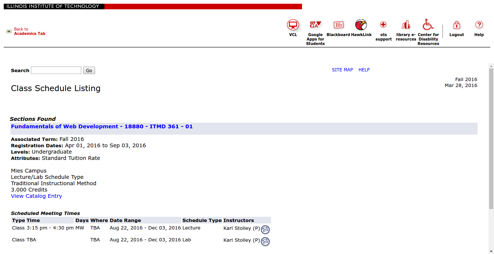
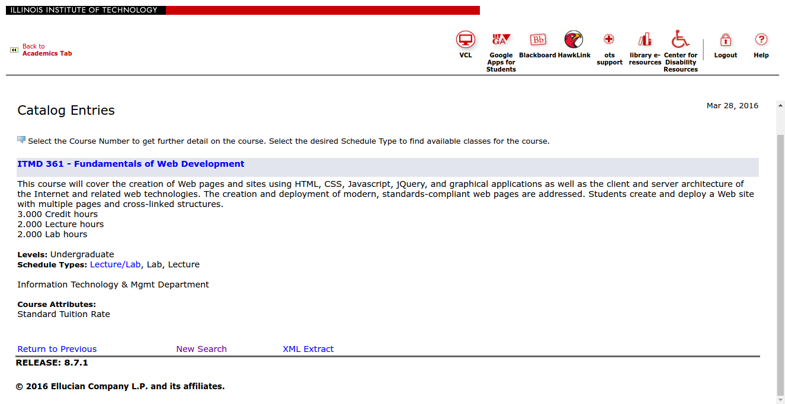

# Task Analysis

## Step 1: Go to MyIIT login page, enter info, click Login

URL: [https://my.iit.edu/cp/home/displaylogin](https://my.iit.edu/cp/home/displaylogin)

Screenshot: 

## Step 2: Click on Academics tab

URL: [http://my.iit.edu/render.userLayoutRootNode.uP?uP_root=root](http://my.iit.edu/render.userLayoutRootNode.uP?uP_root=root)

Screenshot: 

## Step 3: Click on "Look Up Classes" in "Registration Tools" box

URL: [http://my.iit.edu/tag.3578ef7b049e3d1a.render.userLayoutRootNode.uP?uP_root=root&uP_sparam=activeTab&activeTab=u12l1s8&uP_tparam=frm&frm=](http://my.iit.edu/tag.3578ef7b049e3d1a.render.userLayoutRootNode.uP?uP_root=root&uP_sparam=activeTab&activeTab=u12l1s8&uP_tparam=frm&frm=)

Screenshot: 

## Step 4: Select a semester (term) from the list

URL: [http://my.iit.edu/render.UserLayoutRootNode.uP?uP_tparam=utf&utf=%2fcp%2fip%2flogin%3fsys%3dsctssb%26url%3dhttps://my102.iit.edu/banr/bwskfcls.p_sel_crse_search](http://my.iit.edu/render.UserLayoutRootNode.uP?uP_tparam=utf&utf=%2fcp%2fip%2flogin%3fsys%3dsctssb%26url%3dhttps://my102.iit.edu/banr/bwskfcls.p_sel_crse_search)

Screenshot: 

After clicking on the dropdown box, you then select the term that you want to look up classes for. If it is a "view only" term, that means it is not available to register under that term yet. 

## Step 4b (optional): Accept "Statement of Financial Responsibility" after selecting Fall 2016

Frame URL: [https://my102.iit.edu/banr/bwckgens.p_proc_term_date](https://my102.iit.edu/banr/bwckgens.p_proc_term_date)

Screenshot: 

When you select a term that you have not yet searched for in the past, the Statement of Finanicial Responsibility will show up. Click the checkbox stating you agree, and then select continue after that. 

## Step 5: Choose subject(s) from the list in Banner and click Course Search

In this case, we selected "ITM Development"

Frame URL: [https://my102.iit.edu/banr/bwckgens.p_proc_term_date?p_calling_proc=P_CrseSearch&p_term=201710](https://my102.iit.edu/banr/bwckgens.p_proc_term_date?p_calling_proc=P_CrseSearch&p_term=201710)

Screenshot: 

You must scroll through the list in order to search for specific subjects that you want to search. When you find the subject that you want, select it and click either "Course Search" or "Advanced Search", which brings you more advanced options to search for a subject. If you want to select more than on subject, you can click control or command depending on your computer and select multiple subjects. 

## Step 6: Choose a course from the list presented and click "View Sections"

Frame URL: [https://my102.iit.edu/banr/bwskfcls.P_GetCrse](https://my102.iit.edu/banr/bwskfcls.P_GetCrse)

Screenshot: 

After the subject is selected, you then select the specific course that you want to look up classes for. These you can only do one at a time. When "View Sections" is selected, it will take you to that specific course information. 

## Step 7: Click on one of the CRN links to find out more information about the course

Frame URL: [https://my102.iit.edu/banr/bwskfcls.P_GetCrse](https://my102.iit.edu/banr/bwskfcls.P_GetCrse)

Screenshot: 

The CRN number will be highlighted in blue as a link. When selected, it will take you to the class schedule listing for that course. 

## Step 8: Click "View Catalog Entry" link to find out even more information about the course

Frame URL: [https://my102.iit.edu/banr/bwckschd.p_disp_listcrse?term_in=201710&subj_in=ITMD&crse_in=361&crn_in=18880](https://my102.iit.edu/banr/bwckschd.p_disp_listcrse?term_in=201710&subj_in=ITMD&crse_in=361&crn_in=18880)

Screenshot: 

Your general course info is on this page. When the "View Catalog Entry" is selected, it will take you to the IIT course catalog description of that course. 

## Step 9: Read about the course from the catalog entry

Frame URL: [https://my102.iit.edu/banr/bwckctlg.p_display_courses?term_in=201710&one_subj=ITMD&sel_crse_strt=361&sel_crse_end=361&sel_subj=&sel_levl=&sel_schd=&sel_coll=&sel_divs=&sel_dept=&sel_attr=](https://my102.iit.edu/banr/bwckctlg.p_display_courses?term_in=201710&one_subj=ITMD&sel_crse_strt=361&sel_crse_end=361&sel_subj=&sel_levl=&sel_schd=&sel_coll=&sel_divs=&sel_dept=&sel_attr=)

Screenshot: 

This will display all of what the course covers, what it is about, and who it is tailored for. It will also display the credit hours, lecture hours, lab hours, and the level of the course (ex: Undergraduate, Graduate). There is a link at the bottom of the page to return to the previous page, as well as start a new course search. 

